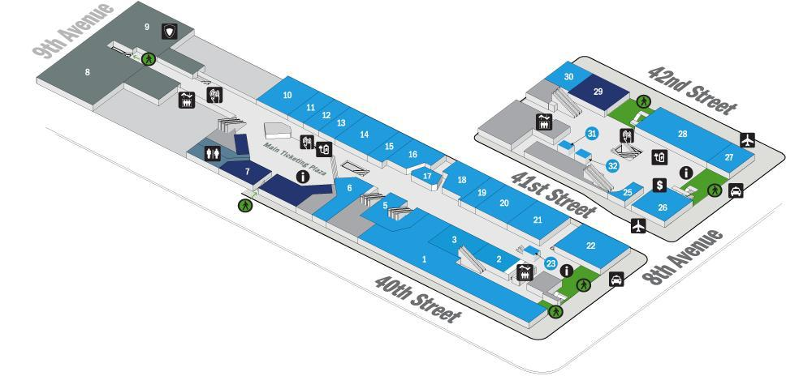

## From JFK airport to Port Authority

1. Take the airport AirTrain in the direction of Jamaica Station, and get off at Sutphin Blvd.

1. Buy a Metrocard. You can pay for the AirTrain and the subway with Metrocards — the AirTrain when exiting ($5), the subway when entering ($2.75/ride).

1. Ride the E train to Manhattan and get off at Times Sq-42nd St.

1. Exit the platform. Stay in the station, and follow signs for Port Authority and/or 40th St.

    The Times Sq station runs underground from 40th to 44th St. There are two connecting underground entrances to Port Authority.

    You will first come to the 41st St connection on your right. Keep walking.

    You will then come to a set of exit turnstiles leading to 40th St. Immediately past the turnstiles on your right is the 40th St underground connection to Port Authority.

1. Enter Port Authority and take the short escalator up to the ground floor. You will be at \#23 on the map below.

    

## From Port Authority to Keiran

1. Take any escalator up to the 200-level departure gates. If after 10pm, take the escalators up another floor to the 300-level gates.

1. Buy a NJTransit bus ticket ($3.50), either from one of the orange vending machines or by downloading the NJTransit app on your phone. You'll need a credit or debit card.

    The ticket should be a 2-zone, roundtrip ticket for  route 128, 165, 166 or 168. A ticket for any of those routes will be accepted on all routes.

1. Go to gate 212. (During rush hour, the line may snake down the gate escalator and back through the terminal. Don't worry; it moves fast.) If after 10pm, go to gate 325.

1. Take any bus from any door.

    The bus will take you through the Lincoln Tunnel, and then along Kennedy Blvd through Weehawken, Union City and West New York (about 25 min).

1. Get off at Ferry Rd. The preceding stop at 69th St is very close; push the exit button (likely a small button above your seat) as soon as the bus pulls away.

1. The bus stop is directly outside my building — the 7100. Enter the lobby. Text me or tell the front desk you're here to see me.
