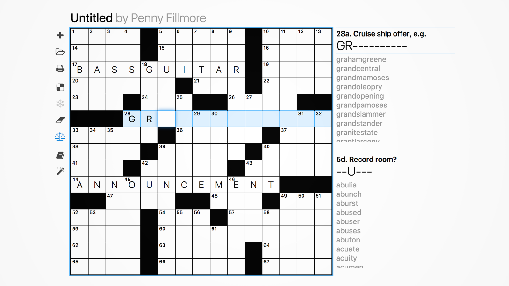

I make crosswords in my spare time. The industry standard software is [Crossword Compiler], which costs up to $170 and is Windows-only. I preferred CMFC, an inexpensive but feature-lite iPad app. While at [Recurse Center], [Raph Levien] and I built [Phil], a free, fast puzzle-maker.

Phil imports and exports `.puz` files, uses a high-quality custom dictionary, and can generate a printable NYT submission in seconds.

[Crossword Compiler]: http://crosswordcompiler.com/
[Phil]: https://keiranking.com/phil
[Raph Levien]: https://levien.com/
[Recurse Center]: https://recurse.com/
